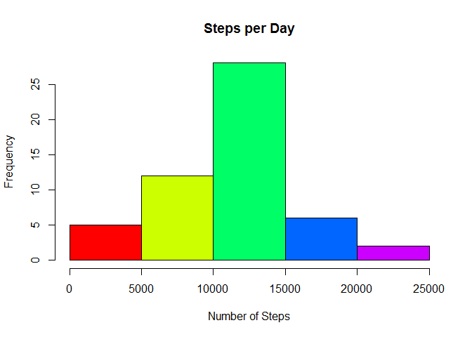
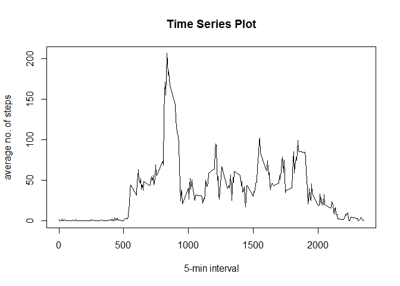
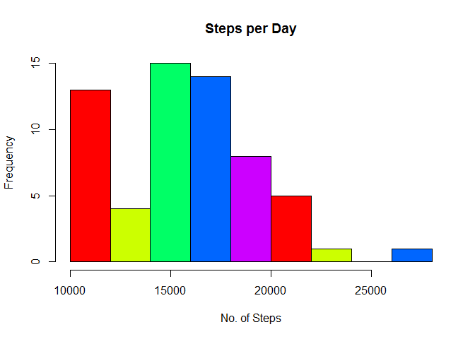
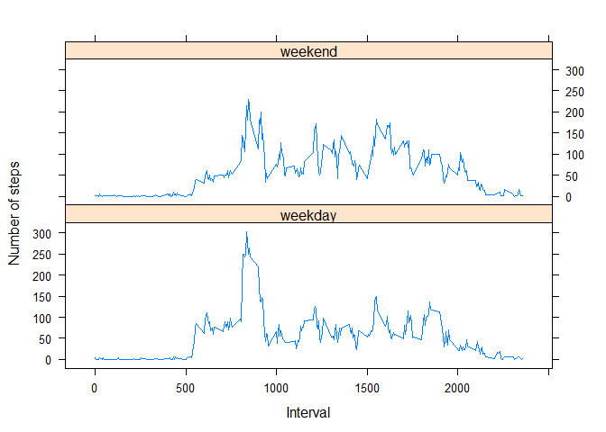

# Reproducible Research: Peer Assessment 1
Pedro Márquez  

## Introduction

It is now possible to collect a large amount of data about personal movement using activity monitoring devices such as a [Fitbit](http://www.fitbit.com/), [Nike Fuelband](http://www.nike.com/us/en_us/c/nikeplus-fuelband), or [Jawbone Up](https://jawbone.com/up). These type of devices are part of the "quantified self" movement - a group of enthusiasts who take measurements about themselves regularly to improve their health, to find patterns in their behavior, or because they are tech geeks. But these data remain under-utilized both because the raw data are hard to obtain and there is a lack of statistical methods and software for processing and interpreting the data.

This assignment makes use of data from a personal activity monitoring device. This device collects data at 5 minute intervals through out the day. The data consists of two months of data from an anonymous individual collected during the months of October and November, 2012 and include the number of steps taken in 5 minute intervals each day.

First, load all libraries needed:

```r
library(dplyr)
```

```
## 
## Attaching package: 'dplyr'
## 
## The following object is masked from 'package:stats':
## 
##     filter
## 
## The following objects are masked from 'package:base':
## 
##     intersect, setdiff, setequal, union
```

```r
library(lattice)
```

## Loading and preprocessing the data
The data for this assignment can be downloaded from the course web site:

*    Dataset: [Activity monitoring data](https://d396qusza40orc.cloudfront.net/repdata%2Fdata%2Factivity.zip) [52K]

The variables included in this dataset are:

*   __steps__: Number of steps taking in a 5-minute interval (missing values are coded as NA)
*    __date__: The date on which the measurement was taken in YYYY-MM-DD format
*    __interval__: Identifier for the 5-minute interval in which measurement was taken

The dataset is stored in a comma-separated-value (CSV) file and there are a total of 17,568 observations in this dataset.


```r
temp <- tempfile()
download.file("http://d396qusza40orc.cloudfront.net/repdata/data/activity.zip",temp)
data <- read.csv(unz(temp, "activity.csv"))
unlink(temp)
```


## What is mean total number of steps taken per day?
For this part of the assignment, we ignore the missing values in the dataset.

1. First, we make a histogram of the total number of steps taken each day, and
2. Second, we calculate and report the mean and median total number of steps taken per day.


```r
d1 <- summarise(group_by(data,date),steps=sum(steps))
hist(d1$steps,col=rainbow(5),main="Steps per Day",xlab="Number of Steps",
     ylab="Frequency")
```

 

```r
m1 <- mean(d1$steps,na.rm=TRUE)
m2 <- median(d1$steps,na.rm=TRUE)
cat("Mean=",m1,", Median=",m2)
```

```
## Mean= 10766.19 , Median= 10765
```


## What is the average daily activity pattern?
1. Make a time series plot (i.e. type = "l") of the 5-minute interval (x-axis) and the average number of steps taken, averaged across all days (y-axis)
2.Which 5-minute interval, on average across all the days in the dataset, contains the maximum number of steps?

```r
d2<-summarise(group_by(data,date),steps=mean(steps))
d3<-summarise(group_by(data,interval),steps=mean(steps,na.rm=TRUE))
plot(d3$interval,d3$steps,type="l", main="Time Series Plot",
     xlab="5-min interval",ylab="average no. of steps")
```

 

```r
i <- (d3[d3$steps==max(d3$steps),])$interval
cat("Interval containing maximum number of steps:",i)
```

```
## Interval containing maximum number of steps: 835
```


## Imputing missing values
Note that there are a number of days/intervals where there are missing values (coded as `NA`). The presence of missing days may introduce bias into some calculations or summaries of the data.

1. Calculate and report the total number of missing values in the dataset (i.e. the total number of rows with NAs)

```r
n <- sum(is.na(data$steps))
cat("The total number of missing values is =",n)
```

```
## The total number of missing values is = 2304
```

2. Devise a strategy for filling in all of the missing values in the dataset. The strategy does not need to be sophisticated. For example, you could use the mean/median for that day, or the mean for that 5-minute interval, etc.

we have chosen to use the `mean of the 5-minute interval` strategy.

3. Create a new dataset that is equal to the original dataset but with the missing data filled in.

```r
for(i in 1:length(data$steps)){
    if (is.na(data$steps[i]) | data$steps[i]==0){
        data$steps[i] <- d3$steps[d3$interval==data$interval[i]]
    }
}
head(data)
```

```
##       steps       date interval
## 1 1.7169811 2012-10-01        0
## 2 0.3396226 2012-10-01        5
## 3 0.1320755 2012-10-01       10
## 4 0.1509434 2012-10-01       15
## 5 0.0754717 2012-10-01       20
## 6 2.0943396 2012-10-01       25
```

4. Make a histogram of the total number of steps taken each day and Calculate and report the __mean__ and __median__ total number of steps taken per day. Do these values differ from the estimates from the first part of the assignment? What is the impact of inputing missing data on the estimates of the total daily number of steps?


```r
d4 <- summarise(group_by(data,date),steps=sum(steps))
hist(d4$steps,col=rainbow(5),main="Steps per Day",xlab="No. of Steps",ylab="Frequency")
```

 

```r
m3 <- mean(d4$steps,na.rm=TRUE)
m4 <- median(d4$steps,na.rm=TRUE)
cat("Mean=",m3,", Median=",m4)
```

```
## Mean= 15875.99 , Median= 15837.74
```

We show the results in a table to make it more readable:

```r
t <- table(c("mean","median"),row.names=c("filled","not filled"))
t[1,]<-c(m3,m1)
t[2,]<-c(m4,m2)
print(t)
```

```
##         row.names
##            filled not filled
##   mean   15875.99   10766.19
##   median 15837.74   10765.00
```

## Are there differences in activity patterns between weekdays and weekends?
For this part the `weekdays()` function may be of some help here. Use the dataset with the filled-in missing values for this part.

1. Create a new factor variable in the dataset with two levels -- "weekday" and "weekend" indicating whether a given date is a weekday or weekend day.

```r
d5 <- character(length(data$date))
for(i in 1:length(data$date)){
    if (weekdays(as.Date(data$date[i])) %in% c("Saturday","Sunday"))
        d5[i] <- "weekend"
    else
        d5[i] <- "weekday"
}
data <- mutate(data,day.type=d5)
```

2. Make a panel plot containing a time series plot (i.e. type = "l") of the 5-minute interval (x-axis) and the average number of steps taken, averaged across all weekday days or weekend days (y-axis).

```r
d6 <- summarise(group_by(data,day.type,interval),steps=mean(steps))
with(d6,xyplot(steps ~ interval | day.type,subset=day.type %in% c("weekday","weekend"),type="l",
               layout=c(1,2),xlab="Interval",ylab="Number of steps"))
```

 
